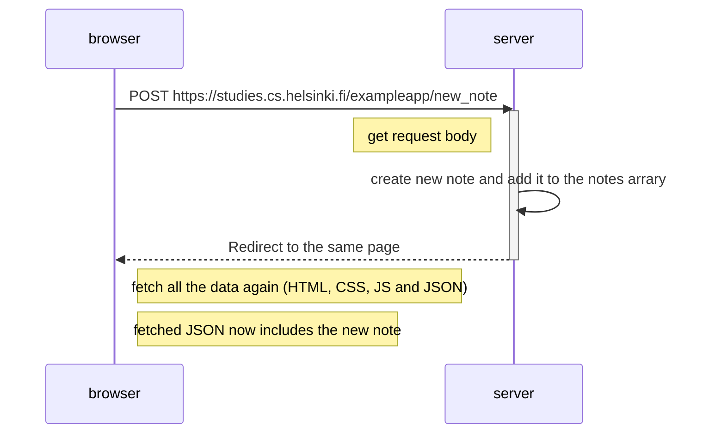

# New note diagram

```mermaid
sequenceDiagram
    participant browser
    participant server

    browser->>server: POST https://studies.cs.helsinki.fi/exampleapp/new_note
    activate server
    Note left of server: get request body
    server->>server: create new note and add it to the notes arrary
    server-->>browser: Redirect to the same page
    deactivate server

    Note right of browser: fetch all the data again (HTML, CSS, JS and JSON)
    Note right of browser: fetched JSON now includes the new note
```
