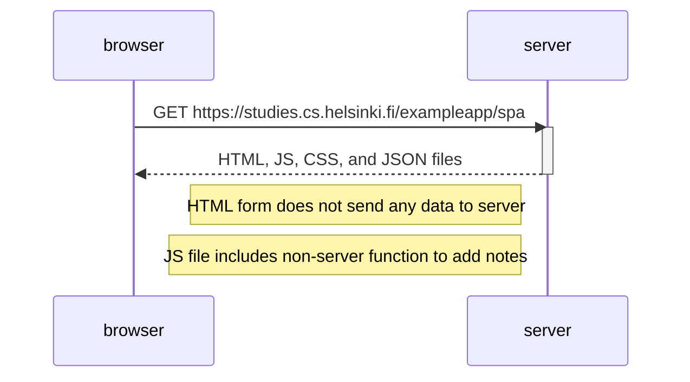

# Single page app diagram

```mermaid
sequenceDiagram
    participant browser
    participant server

    browser->>server: GET https://studies.cs.helsinki.fi/exampleapp/spa
    activate server
    server-->>browser: HTML, JS, CSS, and JSON files
    deactivate server
    Note left of server: HTML form does not send any data to server
    Note left of server: JS file includes non-server function to add notes
```
